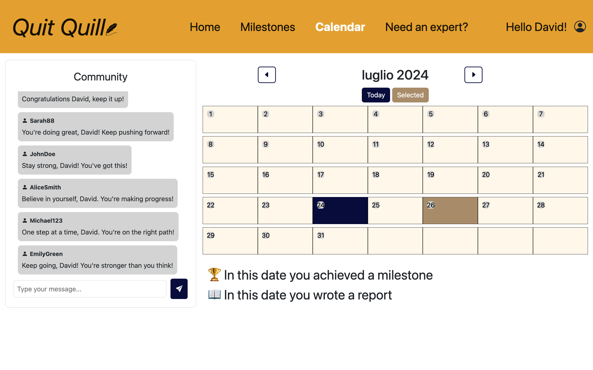
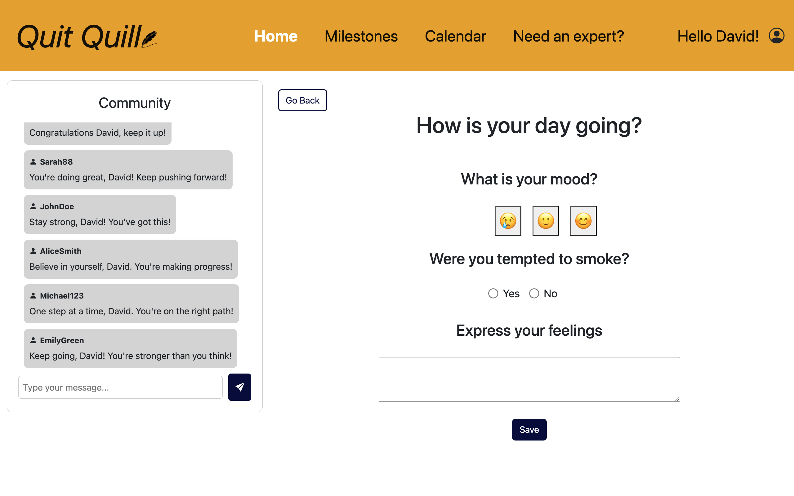

# Quit-Quill
Human Computer Interaction course project. The goal of this activity was to produce a pieece of sowtare that followed the needs of the final user. This needs were discovered with a series of interviews to pepole that are currently smoking and wish to quit, after completing the first phase we mooved on to developing this high fiedlity prototype.

# details of the development
the prototype has been developed with react bootsrap libraries and javascript for the front end, and for the backend express server connected to a local databse with the needed information for the prototype to work properly, this was choosen for how easy is to quickly develop a web application with these framework. 

# the prototype

# what i've learned
the process of building a piece of software that is suited to the needs of the end consumer can be a teadiuos process, but by following its rules and heuristic we can manage to create software that is easy to use and helps efficently the client.
